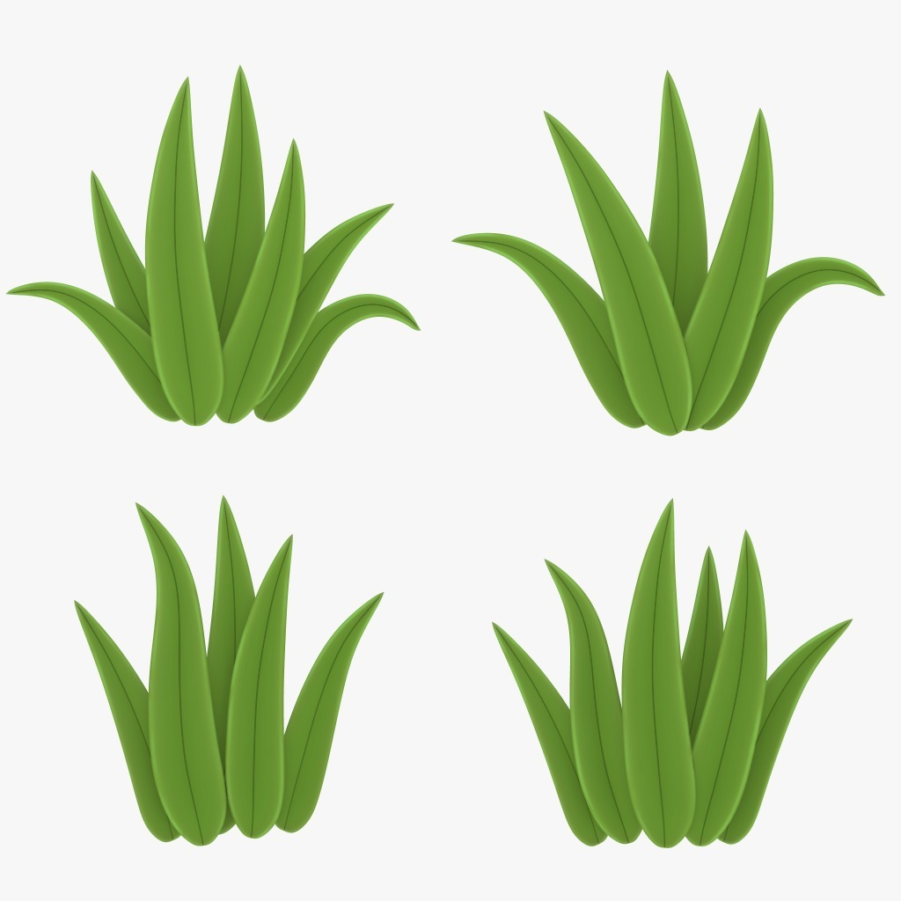

# BotW-Style Grass System

A high-performance, GPU-based grass rendering system for **Unity URP**, inspired by *The Legend of Zelda: Breath of the Wild*.



## ✨ Features

### Rendering
- **GPU Instancing** - Render millions of grass blades efficiently
- **Dual Rendering Modes** - Procedural triangular blades or custom meshes
- **GPU Frustum Culling** - Only render visible grass
- **Distance-based LOD** - Automatic level-of-detail system
- **Wind Simulation** - Realistic wind animation with customizable parameters

### Interaction
- **Player Interaction** - Grass reacts to player movement
- **Real-time Deformation** - Grass bends away from interactors

### Editor Tools
- **Intuitive Painting Tool** - Paint, erase, and modify grass directly in Scene view
- **ScriptableObject Settings** - Easily create and swap grass presets
- **Performance Overlay** - Built-in FPS and instance count monitoring
- **Stress Test Tool** - Validate performance with configurable grass density

### Optimization
- **Switch-Ready** - Optimized for Nintendo Switch (30 FPS target)
- **Compute Shader Culling** - Efficient GPU-based visibility culling
- **Memory Optimized** - Proper buffer management and cleanup

---

## 📋 Requirements

| Requirement | Version |
|-------------|---------|
| Unity | 2022.3 LTS or newer |
| Render Pipeline | URP 14.0+ |
| Input System | New Input System |

---

## 📦 Installation

### Via Git URL (Recommended)
1. Open **Window → Package Manager**
2. Click **+** → **Add package from git URL**
3. Enter: `https://github.com/YOUR_USERNAME/grass-system.git`

### Via Local Folder
1. Copy the `GrassSystem` folder to your project's `Packages/` directory
2. Unity will automatically detect and import the package

---

## 🚀 Quick Start

### 1. Create Grass Settings
Right-click in Project → **Create → Grass System → Grass Settings**

### 2. Setup Grass Renderer
1. Create an empty GameObject
2. Add the `GrassRenderer` component
3. Assign your Grass Settings asset

### 3. Paint Grass
1. Open **Window → Grass System → Grass Painter**
2. Select your terrain/surface
3. Hold **Shift + Left Click** to paint grass

### 4. Add Player Interaction (Optional)
Add the `GrassInteractor` component to your player character.

---

## 🎮 Controls (Grass Painter)

| Action | Control |
|--------|---------|
| Paint | Shift + Left Click |
| Erase | Shift + Ctrl + Left Click |
| Adjust Brush Size | Shift + Scroll Wheel |
| Rotate View | Right Click + Drag |

---

## ⚙️ Configuration

### SO_GrassSettings

| Property | Description |
|----------|-------------|
| **Grass Mode** | Default (procedural) or Custom Mesh |
| **Min/Max Size** | Random size variation range |
| **Min/Max Height** | Height variation for blades |
| **Wind Strength** | Intensity of wind animation |
| **Interaction Radius** | How far player affects grass |
| **LOD Distance** | Distance for LOD transitions |

---

## 📁 Package Structure

```
GrassSystem/
├── Runtime/          # Core scripts
├── Editor/           # Editor tools & inspectors
├── Shaders/          # Grass shaders (Lit/Unlit)
├── Textures/         # Default grass textures
└── Presets/          # Example settings & materials
```

---

## 🔧 API Reference

### GrassRenderer
```csharp
// Access the grass renderer
GrassRenderer renderer = GetComponent<GrassRenderer>();

// Get current grass count
int count = renderer.GrassCount;

// Force refresh
renderer.RefreshGrass();
```

### GrassInteractor
```csharp
// Add to player for grass interaction
[RequireComponent(typeof(GrassInteractor))]
public class Player : MonoBehaviour { }
```

---

## 📄 License

MIT License - See [LICENSE.md](LICENSE.md) for details.

---

## 🙏 Credits

Developed as a technical showcase demonstrating:
- GPU compute shader programming
- Unity URP shader development
- Editor tool development
- Performance optimization for consoles
